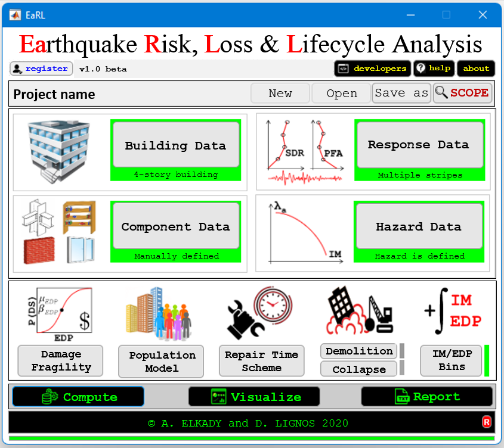

  

https://github.com/user-attachments/assets/0bc93870-8cbd-4ef6-ba1d-791db6efc243

---------------

## EaRL
EaRL is an open source MATLAB-based platform/software for earthquake risk, loss and lifecycle analysis. EaRL provides an interactive and user-friendly platform for evaluating the economic consequences of natural hazards in general, and seismic hazard in particular, on building assets, in support of the performance-based earthquake engineering framework (e.g., FEMA P-58). The platform is supported by a comprehensive library for visualizing and reporting the disaggregated economic losses (repair cost, repair time, injuries, casualties, etc). Being an open-source platform, developed in the popular MATLAB environment, EaRL paves the way for researchers and practicing engineers worldwide to collaborate and contribute to its metadata, functionalities and interactive features. This is further supported by the platform’s well-documented technical details and codebase.

--> Curent compiled installer executable: v1.2408

--> Video tutorials on this YouTube [playlist](https://www.youtube.com/playlist?list=PLz_XdUL-6Y_nbmyXU7Pcdg_XDwvwgGXjF)

## Notes
If you are a developer who plan on collaborating and contributing to EaRL codebase, you are recommended to install GitHub Desktop application and then FORK this repository to your own computer and work on it locally. PULL requests will be considered while giving credit to contributers. To fork the repository click on "FORK" at the top of this page.

--> Brief outline on forking, we suggest this [link](https://www.atlassian.com/git/tutorials/comparing-workflows/forking-workflow)

--> Full introduction to Git and GitHub, we suggest watching this [playlist](https://www.youtube.com/playlist?list=PLRqwX-V7Uu6ZF9C0YMKuns9sLDzK6zoiV)

## Citation
Elkady, A. and Lignos, D. G. (2020). " EaRL - Software for Earthquake Risk, Loss and Lifecycle Analysis." SoftwareX: 12. DOI: [10.1016/j.softx.2020.100607](https://www.sciencedirect.com/science/article/pii/S2352711020303204).
